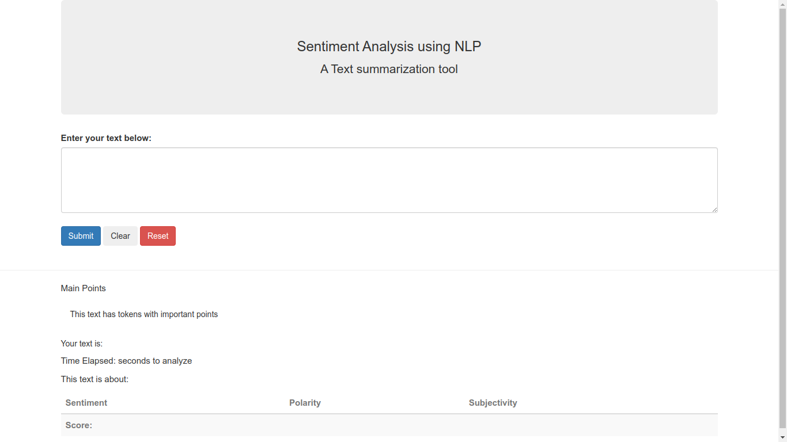

## A Simple Sentiment Analysis Project

## Description
The need to analyze sentiments for companies based on user feedback helps them to determine how users feel about their services which in turn can help in gaining a competitive advantage in the market. 

This project intends to help organizations do so by including a sentiment analyzer for every product in the organization's website. User feedback is analyzed and used to gauge metrics such as user satisfaction and contentment.

## Installation
You need to have Python Installed on your Operating System. Check [Here](https://realpython.com/installing-python/) for instructions on how to install Python on your Computer.

After Installing Python, follow this [guide](https://packaging.python.org/en/latest/guides/installing-using-pip-and-virtual-environments/) to install the following project packages: 
&nbsp;&nbsp;&nbsp;&nbsp;&nbsp;&nbsp;&nbsp;&nbsp;1. flask  
&nbsp;&nbsp;&nbsp;&nbsp;&nbsp;&nbsp;&nbsp;&nbsp;2. flask_bootstrap  
&nbsp;&nbsp;&nbsp;&nbsp;&nbsp;&nbsp;&nbsp;&nbsp;3. textblob  
&nbsp;&nbsp;&nbsp;&nbsp;&nbsp;&nbsp;&nbsp;&nbsp;4. time  
&nbsp;&nbsp;&nbsp;&nbsp;&nbsp;&nbsp;&nbsp;&nbsp;5. collections  

These pacakges contain the project dependencies that the program needs for it to run as intended. After following these steps, you are now ready to see the beauty of NLP(Narutal Language Processing) and sentiment analysis.

# Usage
Navigate to the app.py folder and then, run the following command. <mark>python app.py</mark>.

This is the expected output if you have configured the project dependencies as instructed. 

 

Copy the address shown on your terminal and paste it onto your browser. You will be greeted with such a page as this:  

 

In the textbox provided, the user enters their input and the Python app.py logic performs a sentiment using Textblob. Leran more about Textblob and how it performs Sentiment analyis from its official documentaion [here](https://textblob.readthedocs.io/en/dev/index.html).  

Here is an example of the a user statement and how the program performs the sentiment Analysis.  
  
  

This is a basic program. Please feel free to contribute and add to the codebase.   

Thank you